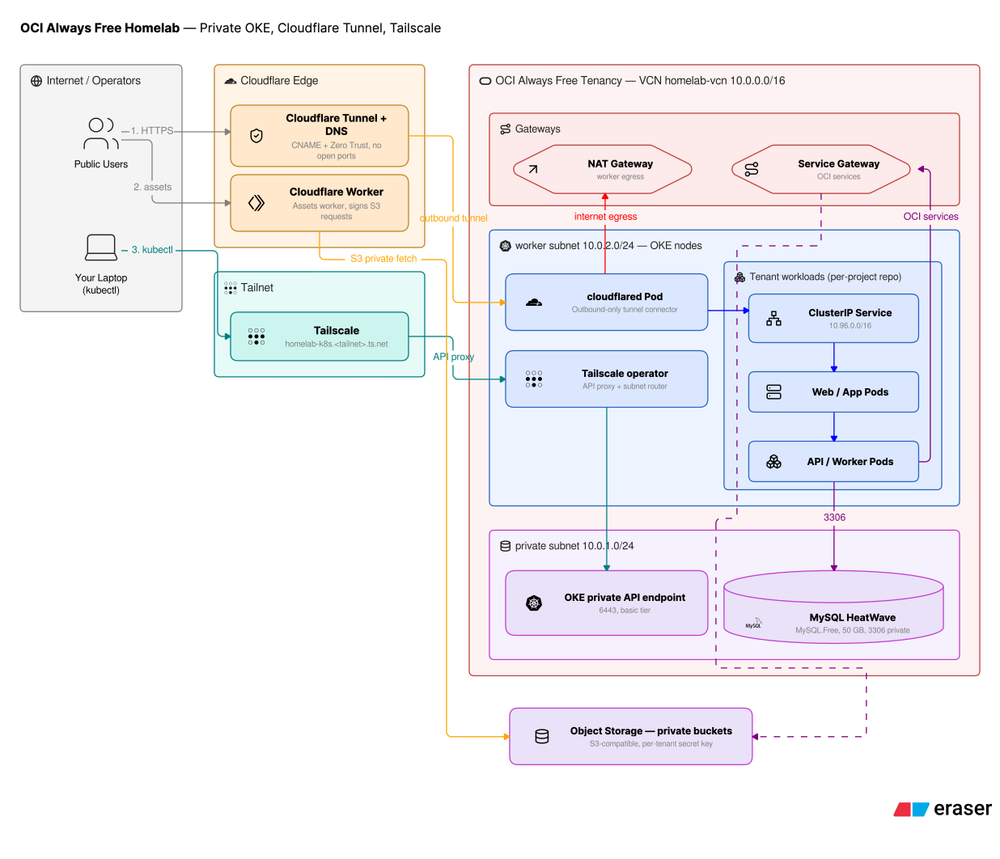

# free-homelab-terraform

[](https://github.com/kendrickwkc/free-homelab-terraform/actions/workflows/terraform.yml)
[](LICENSE)
[](.github/workflows/terraform.yml)
[](https://registry.terraform.io/providers/oracle/oci)
[](renovate.json)
[](https://github.com/kendrickwkc/free-homelab-terraform/generate)

A multi-tenant Kubernetes platform on the
[OCI Always Free tier](https://www.oracle.com/cloud/free/): private OKE
cluster, per-tenant Cloudflare Tunnels, Sealed Secrets in git, budget alarm on
any billable spend. $0/month in your home region.

Use GitHub's **Use this template** to create your copy, then follow
[Quickstart](#quickstart). For a single-cluster GitOps alternative on the same
free tier, see [nce/oci-free-cloud-k8s](https://github.com/nce/oci-free-cloud-k8s).

<p>
  
</p>

## What you get

| Component | Detail |
|---|---|
| **Kubernetes** | OKE basic cluster, private API endpoint; Tailscale access, bastion bootstrap |
| **Node pools** | `general` 1× 2 OCPU / 12 GB (label `storage=true`) · `small` 2× 1 OCPU / 6 GB |
| **Storage** | Block Volume CSI ships with OKE; the committed StorageClass pins `oci-bv` (`WaitForFirstConsumer`) |
| **Database** | Shared MySQL (`MySQL.Free`); per-tenant databases via a 4-statement SQL snippet over the tailnet |
| **Secrets** | [Sealed Secrets](https://github.com/bitnami-labs/sealed-secrets) — encrypted in git |
| **Ingress** | Per-tenant Cloudflare Tunnel + optional assets Worker |
| **Guardrails** | Budget + billable-spend alarm |

## Always Free limits

The topology uses the limits exactly, with zero headroom, and only works in
your tenancy's **home region**. Specs have changed before (most recently
2026-06); verify against
[Oracle's docs](https://docs.oracle.com/en-us/iaas/Content/FreeTier/freetier_topic-Always_Free_Resources.htm).

- **Compute:** 4 OCPU / 24 GB total (A1 Flex); `1 OCPU` caps at 6 GB.
- **Storage:** 200 GB total = 3× 50 GB boot + 50 GB block; after boot volumes,
  exactly **one 50 GB block-backed PVC** fits the tenancy.
- **Object Storage:** 20 GB + 50K API requests/month.
- **MySQL:** one `MySQL.Free` DB system per tenancy.

Deploying outside the home region, exceeding any cap above, adding a 51 GB
volume, a second MySQL system, or an OKE *enhanced* cluster bills you.

## Quickstart

- OCI account (target region = home region)
- `terraform >= 1.5` (≥ 1.12 for the OCI backend), `oci` CLI (`oci setup config`)
- `kubectl`, `helm`, `kubeseal`
- [Tailscale](https://tailscale.com) account + local client
- One Cloudflare account holding every tenant zone
- Optional: a MySQL client, needed only to create per-tenant databases

**0 — Create the remote-state bucket:**

```sh
oci os bucket create --compartment-id "$OCI_COMPARTMENT_OCID" \
  --namespace-name "$OCI_NAMESPACE" --name terraform-state \
  --public-access-type NoPublicAccess --storage-tier Standard
oci os bucket update --namespace-name "$OCI_NAMESPACE" \
  --name terraform-state --versioning Enabled
```

**1 — Platform:** VCN, private OKE cluster, MySQL, bastion, budget alarm.

```sh
cd platform
cp terraform.tfvars.example terraform.tfvars    # compartment, ssh key, mysql admin, alert email
cp backend.tfbackend.example backend.tfbackend  # namespace, region
terraform init -backend-config=backend.tfbackend && terraform apply
```

**2 — Cluster services:** Sealed Secrets, kubeconfig via bastion,
Tailscale operator ([docs/tailscale.md](docs/tailscale.md)):

```sh
./scripts/install-sealed-secrets.sh
./scripts/connect-k8s.sh          # temporary 6443 tunnel; kubeconfig setup per docs/bastion.md
OAUTH_CLIENT_ID=… OAUTH_CLIENT_SECRET=… ./scripts/install-tailscale-operator.sh
kubectl apply -f cluster/tailscale-connector.yaml
```

Optional shared Meilisearch: seal a `MEILI_MASTER_KEY` into a Secret named
`meilisearch-master-key` in the `platform` namespace, then
`kubectl apply -f cluster/meilisearch.yaml`. The 50 Gi PVC consumes the
entire remaining block-volume budget.

**3 — First tenant:** copy `examples/example-tenant/` into the
project repo, `terraform apply`, seal the tunnel token, deploy the example
app. Live at `https://<hostname>.<your-domain>`.
Walkthrough: [examples/example-tenant/README.md](examples/example-tenant/README.md).

**4 — Add projects** by repeating step 3 with a new name. The budget alarm
watches spend.

## Tenants

Tenants live in each project's own repo; your domains and app layout stay out
of the public template. A tenant is a `module "tenant"` call plus Kubernetes
manifests:

```hcl
data "terraform_remote_state" "platform" {
  backend = "oci"
  config = { bucket = "terraform-state", namespace = var.oci_namespace,
             region = var.region, key = "platform/terraform.tfstate" }
}

module "tenant" {
  # your template copy — bump ?ref= to pull module fixes from upstream
  source = "github.com/<your-username>/free-homelab-terraform//modules/tenant?ref=v1.1.0"

  name           = "myproject"
  zone           = "your-domain.example"
  cf_account_id  = var.cf_account_id
  compartment_id = data.terraform_remote_state.platform.outputs.compartment_id
  region         = var.region
  buckets        = ["myproject-assets", "myproject-backups"]   # prefix with tenant name
  worker_enabled = true
  assets_bucket  = "myproject-assets"
}
```

Conventions (overridable via module inputs): expose your app as a Kubernetes
`Service` named after the tenant on port 8080 (`app_service =
http://myproject:8080` by default); bucket names go in the shared namespace —
prefix them with the tenant name.

Pin a release tag (`?ref=v1.1.0`). The
[example tenant](examples/example-tenant/) shows the complete layout — its
README is the onboarding runbook, including private-registry pull secrets and
bridging Terraform outputs into sealed secrets.

## Secrets

Plaintext never enters git:

```sh
kubeseal --controller-name sealed-secrets-controller --controller-namespace kube-system \
  < secret.yaml > secret-sealed.yaml
git add secret-sealed.yaml
```

`scripts/install-sealed-secrets.sh` backs up the controller key to
`~/.sealed-secrets-keys/`. Copy it somewhere safe and offline — it is the
only way to decrypt sealed secrets.

## Limitations & notes

- **No GitOps.** Apps deploy with `kubectl apply`; a Flux path is on the
  roadmap.
- **MySQL tenant DBs are manual SQL** (four statements from any tailnet
  device). A Terraform MySQL provider is a future option.
- **Single availability domain.** Fault domains, not multiple ADs, stay
  within the free tier.
- **Cloudflare provider v4.** The v5 migration is a known follow-up.
- **One block-backed PVC.** Stateful extras must fit the remaining 50 GB.
- **Pinned images.** cloudflared and the Tailscale operator chart are pinned;
  bump deliberately.
- **Private by default.** Cluster API, pod IPs, and ClusterIPs have no public
  addresses.
- **Bastion is open by default** (`bastion_client_cidrs = ["0.0.0.0/0"]`);
  set it to the tailnet CIDR once Tailscale runs.
- **The assets Worker serves its bucket publicly** — static assets only.

## License

MIT — see [LICENSE](LICENSE).
